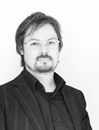
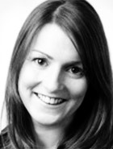
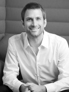
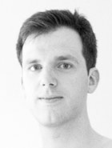
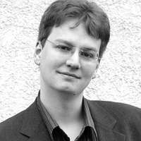
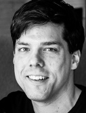
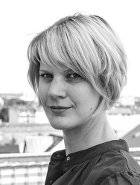
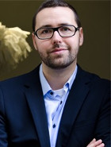

# Wer macht das?

## Verein für Netzkultur

2010 haben sich die Organisatoren des 1. Barcamp Mainz zum Verein zur Förderung der Netzkultur im Rhein-Main Gebiet e.V. zusammengetan. Als Verein treten wir seitdem als Veranstalter der BarCamps RheinMain auf. So sind wir unabhängig und können unsere Ideen von einer nachhaltigen Netzkultur umsetzen.  
[Mehr zum Verein »](http://netzkultur-rheinmain.de/)

## Team

Hier stellt sich das Team des BarCamp RheinMain 2015 kurz und knapp vor.

----

**[Nicola Appel](https://www.xing.com/profiles/Nicola_Appel)**  
[Articulate International Inc.](https://de.articulate.com/) | International Community Manager

*Ich unterstütze das BarCamp RheinMain,* weil ich Veranstaltungen wie das Barcamp einfach spannend finde – daraus ergeben sich Kooperationen und neue Kontakte, man bekommt Inspirationen, hält sich auf dem Laufenden und bildet sich gleichzeitig weiter. Es ist für mich selbstverständlich, dass ich mithelfe und meinen Teil dazu beitrage.

*Twitter:* [@NicolaAppel](https://www.twitter.com/NicolaAppel)  
*Tags:* #CommunityManagement #eLearning #Lokalisierung

----

**[Chrisula Dingiludi](https://www.xing.com/profiles/Chrisula_Dingiludi)**  
Project Manager | [SYZYGY Deutschland GmbH](http://www.syzygy.de)

*Ich unterstütze das BarCamp RheinMain,* weil es für mich die perfekte Mischung aus Event, digitaler Welt und Kommunikation ist. Das möchte ich so nah wie möglich miterleben: mit spannenden Themen, neuen Kontakten und reichlichen Austausch im BarCamp-Charakter.

*Twitter:* [@ChrisulaD](http://twitter.com/ChrisulaD)  
*Tags:* #Strategie #Beratung #Digital

----

**[Norbert Gilles](https://www.xing.com/profile/norbertgilles)**  
Geschäftsführer der [giinco GmbH](http://giinco.de/)

*Ich unterstütze das BarCamp RheinMain,* weil es mich einfach interessiert und damit das Event stattfindet braucht man Leute. Und überhaupt: ”Es gibt nicht Gutes, außer man tut es”!

*Twitter:* [@norbertgilles](https://www.twitter.com/norbertgilles)  
*Tags:* #interactive #agileEntwicklung #applications

----

**[Christa Goede](http://www.xing.com/profile/Christa_Goede)**  
Freiberuflerin / [Christa Goede - Text. Konzept. Projekt.](http://www.christagoede.de/)

*Ich unterstütze das BarCamp RheinMain,* weil ich BarCamps liebe! Und gerne Dinge mit anderen zusammen stemme.

*Twitter:* [@ChristaGoede](http://twitter.com/ChristaGoede)  
*Tags:* #Text #Konzept #Internet

----

**[Irmela Ketelhut](https://www.xing.com/profile/Irmela_Ketelhut)**  
Projektmanagerin bei [netz98](http://netz98.de)

*Ich unterstütze das BarCamp RheinMain,* weil es einfach großen Spaß macht, ein solches Event zu organisieren und mittendrin statt nur dabei zu sein. Man trifft interessante Menschen, diskutiert aktuelle und spannende Themen und knüpft ständig neue Kontakte.

*Tags:* #PM #e-commerce #kommunikation

----

**[Tom Klose](https://www.xing.com/profile/Thomas_Klose)**  
Executive Creative Director der [BARTENBACH AG](http://www.bartenbach.de/)

*Ich unterstütze das BarCamp RheinMain,* weil Mitmischen schon immer mein Ding war!

*Twitter:* [@thomasklose](https://www.twitter.com/thomasklose)  
*Tags:* #ux #design

----

**[Martin Kraft](https://www.xing.com/profile/Martin_Kraft)**  
Freiberufler / [Martin Kraft // Interaktionsdesign](http://www.martinkraft.com/)

*Ich unterstütze das BarCamp RheinMain,* weil ich helfen möchte, die Ideen des freien Netzes ins „echte Leben“ zu tragen.

*Twitter:* [@martin_kraft](https://www.twitter.com/martin_kraft)  
*Tags:* #Design #Netzpolitik #Wikipedia

----

**[Helge Richter](https://www.xing.com/profile/Helge_Richter)**  
Manager bei Sopra Steria GmbH

*Ich unterstütze das BarCamp RheinMain,* weil ich es toll finde, wenn Menschen zusammenkommen um sich selbst und andere weiter zu bringen!

*Tags:* #Netzpolitik #FutureTech #Banking

----

**[Markus Tacker](http://cto.hiv/)**  
[Fintura](https://fintura.de/) | Chief Technical Officer

*Ich unterstütze das BarCamp RheinMain,* weil es für mich die spannendste Veranstaltung im RheinMain-Gebiet ist und ich möchte, dass auch im nächsten Jahr ein BarCamp RheinMain statt findet.

*Twitter:* [@coderbyheart](https://twitter.com/coderbyheart)  
*Tags:* #futureofwork #softwarecraftsmanship #startups

----

**[Tanja Tacker](https://www.xing.com/profile/Tanja_Tacker)**  
Projektmanagerin Mobile Solutions / Schwerpunkt UX bei [DB Systel GmbH](https://www.dbsystel.de/)

—

*Twitter:* [@kamilleblumm](https://www.twitter.com/kamilleblumm)

----

**[Matthias Thürling](https://www.xing.com/profile/MATTHIAS_THUeRLING)**  
Gründer von [intoCommerce](http://www.into-commerce.de/)

*Ich unterstütze das BarCamp RheinMain,* weil es nirgends sonst so viele kreative und kompetente Menschen gibt, die bereitwillig ihr Wissen teilen. Wissen teilen, Erfahrungen austauschen und gemeinsam wachsen. Das ist BarCamp!

*Tags:* #e-commerce #shopware #b2b

----
@order=3
@title=Wer macht das?
