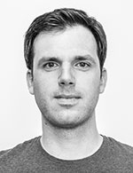

# Wer macht das?

## Verein für Netzkultur

2010 haben sich die Organisatoren des 1. Barcamp Mainz zum Verein zur Förderung der Netzkultur im Rhein-Main Gebiet e.V. zusammengetan. Als Verein treten wir seitdem als Veranstalter der BarCamps RheinMain auf. So sind wir unabhängig und können unsere Ideen von einer nachhaltigen Netzkultur umsetzen.  
[Mehr zum Verein »](http://netzkultur-rheinmain.de/)

## Mediencampus der Hochschule Darmstadt

Der Mediencampus der Hochschule Darmstadt (h_da) beschäftigt sich in Lehre, Forschung und Entwicklung mit neuen und innovativen Medien und Medienformaten. Hierzu verfügt der Mediencampus der h_da über sehr breite Kompetenz, die Felder wie Animation & Games, Informationswwissenschaften, Interactive Media Design, Motion Pictures, Online-Journalismus, Online-PR und -Marketing, Sound & Music und Production und Wissenschaftsjournalismus abdeckt.  
[Mehr zum Mediencampus »](Mediencampus/Info)

## Team

Hier stellt sich das Team des BarCamp RheinMain Dieburg 2013 kurz und knapp vor.

----

**[Christa Goede](http://www.xing.com/profile/Christa_Goede)**  
Freiberuflerin / [Christa Goede - Text. Konzept. Projekt.](http://www.christagoede.de/)

*Ich unterstütze das BarCamp RheinMain,* weil ich BarCamps liebe! Und gerne Dinge mit anderen zusammen stemme.

*Twitter:* [@ChristaGoede](http://twitter.com/ChristaGoede)  
*Tags:* #Text #Konzept #Internet

----

**Chrisula Dingiludi**

----

**[Irmela Ketelhut](https://www.xing.com/profile/Irmela_Ketelhut)**  
Projektmanagerin bei [netz98](http://netz98.de)

*Ich unterstütze das BarCamp RheinMain,* weil es einfach großen Spaß macht, ein solches Event zu organisieren und mittendrin statt nur dabei zu sein. Man trifft interessante Menschen, diskutiert aktuelle und spannende Themen und knüpft ständig neue Kontakte.

*Tags:* #PM #e-commerce #kommunikation

----

**[Markus Tacker](http://tckr.cc/)**  
[coder::by(♥);](http://coderbyheart.de/) // Freelance Señor Web Backend Dev

*Ich unterstütze das BarCamp RheinMain,* weil es für mich die spannendste Veranstaltung im RheinMain-Gebiet ist und ich möchte, dass auch im nächsten Jahr ein BarCamp RheinMain statt findet.

*Twitter:* Nutze ich nicht mehr …  
*Tags:* #softwarecraftsmanship #startups #futureofwork

----

**[Martin Kraft](https://www.xing.com/profile/Martin_Kraft)**  
Inhaber von [Martin Kraft // Interaktionsdesign](http://www.martinkraft.com/)

*Ich unterstütze das BarCamp RheinMain,* weil ich als langjähriger “Netzbewohner” finde es einfach toll finde, den Gedanken einer offenen und freien Web-Community in das “echte Leben” zu tragen.

*Twitter:* [@martin_kraft](https://www.twitter.com/martin_kraft)  
*Tags:* #Interaktionsdesign #GenerativeGrafik #Netzpolitik

----

**[Nicola Appel](https://www.xing.com/profiles/Nicola_Appel)**  
[Frankfurt School Verlag GmbH](http://www.frankfurt-school-verlag.de/) | Manager Digitale Medien

*Ich unterstütze das BarCamp RheinMain,* weil ich Veranstaltungen wie das Barcamp einfach spannend finde – daraus ergeben sich Kooperationen und neue Kontakte, man bekommt Inspirationen, hält sich auf dem Laufenden und bildet sich gleichzeitig weiter. Es ist für mich selbstverständlich, dass ich mithelfe und meinen Teil dazu beitrage.

*Twitter:* [@NicolaAppel](https://www.twitter.com/NicolaAppel)  
*Tags:* #web20 #communitymanagement #eBooks

----

**[Norbert Gilles](https://www.xing.com/profile/norbertgilles)**  
Geschäftsführer der [giinco GmbH](http://giinco.de/)

*Ich unterstütze das BarCamp RheinMain,* weil es mich einfach interessiert und damit das Event stattfindet braucht man Leute. Und überhaupt: ”Es gibt nicht Gutes, außer man tut es”!

*Twitter:* [@norbertgilles](https://www.twitter.com/norbertgilles)  
*Tags:* #interactive #agileEntwicklung #applications

----

**Tanja Tacker**

----

**Thomas Pleil**

----

**[Tom Klose](https://www.xing.com/profile/Thomas_Klose)**  
Creative Director der [CAMAO AG](http://www.camao.de/)

*Ich unterstütze das BarCamp RheinMain,* weil Mitmischen schon immer mein Ding war!

*Twitter:* [@thomasklose](https://www.twitter.com/thomasklose)  
*Tags:* #ux #design

@order=3
@title=Wer macht das?
